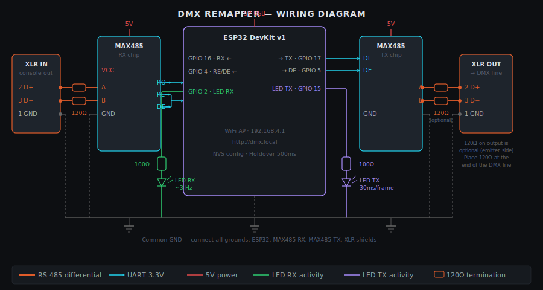

# DMX Remapper

A lightweight DMX512 channel remapper built on an ESP32, designed for live performance venues. It sits between a legacy DMX console and the main DMX line, intercepts incoming frames, and redistributes channels according to configurable rules — all managed through a self-hosted web interface.

> **Built for a real-world scenario:** an old console where all fixtures share the same address. The ESP32 intercepts and remaps channels on the fly, while a modern console (e.g. GrandMA3) connects in parallel on the same DMX line.

```
Old console → [ESP32 Remapper] → DMX line → Fixtures
```

---

## Features

- **Channel remapping** — define named groups, each with a source address, channel count, and multiple destinations
- **Live monitor** — real-time 512-channel view of both input and output, color-coded by group, collapsible panels
- **Group hover** — hover a group on either grid to highlight it across both grids simultaneously
- **Output test** — per-channel sliders per group, Full / Zero / 50% shortcuts, immediate send with live feedback
- **Holdover** — retransmits last known DMX frame if input is lost (500 ms threshold)
- **mDNS** — accessible at `http://dmx.local` on Mac and iOS with no extra software
- **Fully offline** — no internet required, no external fonts or CDN, runs entirely on the ESP32 AP
- **NVS persistence** — configuration saved to flash, survives reboots
- **RX activity LED** — hardware visual feedback on incoming signal

---

## Hardware

| Component | Details |
|---|---|
| ESP32 DevKit v1 | ESP32-WROOM-32 |
| MAX485 (×2) | One for RX, one for TX |
| XLR connectors | 3-pin, female (in) + male (out) |
| LED RX | GPIO 2 + 100 Ω resistor |
| Power supply | AMS1117-5.0 regulator or USB |

### Pin mapping

| GPIO | Role |
|---|---|
| 16 | DMX RX — MAX485 RO (receive) |
| 17 | DMX TX — MAX485 DI (transmit) |
| 4 | MAX485 RX enable (RE+DE, LOW = listen) |
| 5 | MAX485 TX enable (DE, HIGH = emit) |
| 2 | RX activity LED (~6 Hz when signal present) |

---

## Wiring diagram



### Pin connections

**MAX485 RX chip** (input side)

| MAX485 pin | Connect to |
|---|---|
| A (D+) | XLR pin 3 |
| B (D−) | XLR pin 2 |
| RO | ESP32 GPIO 16 |
| RE + DE | ESP32 GPIO 4 (tied together, always LOW) |
| VCC | 5V |
| GND | Common GND |

**MAX485 TX chip** (output side)

| MAX485 pin | Connect to |
|---|---|
| DI | ESP32 GPIO 17 |
| DE | ESP32 GPIO 5 (always HIGH) |
| A (D+) | XLR pin 3 |
| B (D−) | XLR pin 2 |
| VCC | 5V |
| GND | Common GND |

> **Power:** power the MAX485 chips at 5V. The ESP32 can be powered via USB or from a 5V regulator (e.g. AMS1117-5.0) from a 12V stage supply.

---

## Software dependencies

| Library | Version | Source |
|---|---|---|
| Arduino ESP32 core | **2.0.17** | Espressif — Board Manager |
| esp_dmx | **4.1.0** | someweisguy — Library Manager |
| ArduinoJson | **7.x** | Library Manager |
| ESPAsyncWebServer | **3.x** | ESP32Async — Library Manager |
| AsyncTCP | **3.x** | ESP32Async — Library Manager |
| ESPmDNS | included | ESP32 core |

> **Important:** `DMX_NUM_2` crashes with esp_dmx 4.1.0 on ESP32-WROOM (known bug [#150](https://github.com/someweisguy/esp_dmx/issues/150)). This project works around it by using:
> - **RX** → `esp_dmx` on `DMX_NUM_1` (UART1, GPIO16)
> - **TX** → `esp_dmx` on `DMX_NUM_0` (UART0, remapped to GPIO17 — UART0 is freed from Serial before installing)

---

## Installation

1. Install the Arduino IDE and the ESP32 board package (version **2.0.17** via Board Manager)
2. Install the required libraries listed above
3. Clone or download this repository
4. Open `main.cpp` in Arduino IDE (or copy both `main.cpp` and `web_ui.h` into a sketch folder)
5. Select your board: **ESP32 Dev Module**
6. Flash to your ESP32

> **Note:** Serial debug output is only available during the initial setup phase. Once `Serial.end()` is called to free UART0 for DMX TX, subsequent `Serial.println()` calls are silent. All startup messages are printed before this point.

---

## Usage

1. Power the ESP32
2. Connect to the WiFi AP: **`DMXR`** (hidden SSID) / password: **`dmx12345`**
3. Open **`http://dmx.local`** in your browser (or `http://192.168.4.1` on Windows/Android)
4. Configure your remap rules in the **Configuration** tab
5. Click **Save** — the ESP32 will restart and apply the new rules
6. Monitor live channel values in the **Monitor** tab
7. Test output independently in the **Output test** tab

---

## Web interface

### Monitor
Real-time dual grid showing all 512 channels — input (orange) and output (cyan). Each configured group is color-coded with a border, label, and cross-grid hover highlight. Each panel can be collapsed by clicking its title.

### Configuration
Add, edit, and delete remap rules. Each rule defines:
- **Name** — label shown in the monitor and test views
- **Source address** — first DMX channel to read from
- **Channels** — how many consecutive channels to copy
- **Destinations** — one or more target addresses, added with the **+** button (auto-increments by channel count)

### Output test
Send test values directly to output channels without needing a console connected. Incoming DMX is frozen in `dmxOut` while a test is active — the monitor still shows live input. A **Back to live** button reapplies the remap rules from the current input.

---

## Security

### Change the default password

The default WiFi credentials are hardcoded in `main.cpp`:

```cpp
const char* AP_SSID = "DMXR";
const char* AP_PASS = "dmx12345";
```

**You must change `AP_PASS` before deploying.** The minimum WPA2 password length is 8 characters.

### Hidden SSID

By default, the SSID is **not broadcast** — it won't appear in the list of available networks. To connect, enter the network name manually:

- **macOS:** WiFi menu → "Other…" → enter `DMXR` and the password
- **iOS:** Settings → Wi-Fi → "Other…" → enter name and password
- **Windows:** WiFi settings → "Hidden network" → enter name and password

To make the SSID visible (e.g. during setup), change the `softAP` call in `main.cpp`:

```cpp
// Hidden (default)
WiFi.softAP(AP_SSID, AP_PASS, 1, 1);

// Visible
WiFi.softAP(AP_SSID, AP_PASS);
```

---

## WiFi & network

| Setting | Value |
|---|---|
| SSID | `DMXR` (hidden) |
| Password | `dmx12345` ⚠️ change before deploying |
| IP address | `192.168.4.1` |
| mDNS hostname | `dmx.local` |
| Protocol | HTTP (port 80) |

mDNS works natively on **macOS** and **iOS**. On **Windows**, install [Bonjour](https://support.apple.com/kb/DL999) (bundled with iTunes). On **Android**, use the IP address directly.

---

## API reference

| Endpoint | Method | Description |
|---|---|---|
| `/` | GET | Web interface |
| `/api/config` | GET | Get current rules |
| `/api/config` | POST | Save rules (JSON body) |
| `/api/dmx` | GET | Live snapshot `{in:[...], out:[...]}` |
| `/api/test` | POST | Set output channel (`ch`, `val` params) — activates test mode |
| `/api/test/reset` | POST | Exit test mode, reapply rules from current input |
| `/api/ping` | GET | Health check |
| `/api/reboot` | POST | Restart ESP32 |
| `/api/reset` | POST | Clear NVS config + restart |

---

## License

MIT — free to use, modify, and distribute.

---

## Author

**boherm** — [boherm.dev](https://boherm.dev)